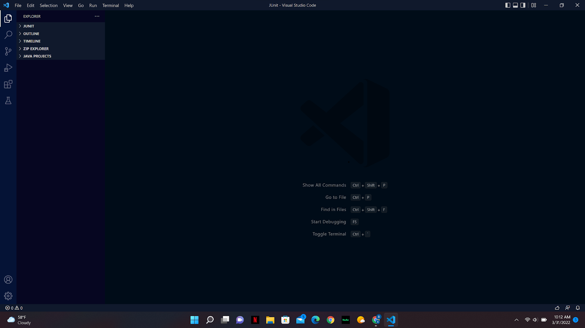

# CSE15L Week 2 Lab Report 

### Installing VScode
- go to [the VS code website](https://code.visualstudio.com/) and download Visual Studio Code for your operating system 
- open VS Code once downloaded, it should look something like this 
- open folders/files or create one to begin writing code

### Remotely Connecting
- make sure that OpenSSH client/server are installed
- your username is: cs15lsp22apf
- enter "ssh cs15lsp22apf@ieng6.ucsd.edu" 
- follow the prompts
- once connected the terminal should look something like this ![Image] (C:\Users\Brian\OneDrive\Pictures\SSH PIC.png)

### Trying Some Commands
- commands can be entered locally and you can use SSH to make remote commands
- some most common/basic commands you should know are: **cd**(change directory) and **ls-a** (lists all files in current directory)
- 
- A few usefull commands that can be used to log out of the remote terminal are: Ctrl-D or exit

### Moving Files with scp 
- the scp command is always run from the client
- the command copies files to a remote computer
- enter "scp FileName.java cs15lsp22zz@ieng6.ucsd.edu:~/" where FileName is the name of the file you are copying
- now you FileName.java will be in the home directory of the ieng6 computer 
- Your output should look like this: 
- now if you did the ls command FileName.java would appear 

### Setting an SSH Key 
- creating the SSH key will allow you to SSH or SCP between computers without a password
- first on the client eneter ssh-keygen
- save the key at 
- do not enter anything for the passphrase
- enter "ssh cs15lsp22apf@ieng6.ucsd.edu"
- enter "mkdir .ssh"
- now logout 
- enter "scp /Users/cs15lsp22apf/.ssh/id_rsa.pub cs15lsp22apf@ieng6.ucsd.edu:~/.ssh/authorized_keys" to copy the key
- 
  
### Optimizing Remote Running
- the up arrow recalls the last command that was run 
- writing a command in quotes at the end of an ssh command will run it on the remote server 
- separate commands with semicolons to run on the same line 
- 

